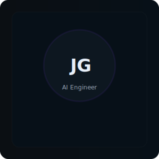
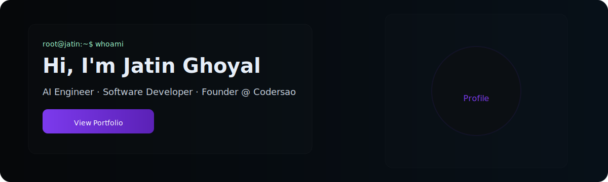

<!--
  Premium GitHub Profile README (dark, terminal + cards layout)
  Generated/created manually to match visual reference. Editable via data/config.json
-->

<table width="100%"><tr>
<td valign="top" width="220" style="padding-right:20px">

<!-- Sidebar simulated -->

  

    

      
      

        
Jatin Ghoyal

        
AI Engineer

      

    

    <!-- nav -->
    

      
🏠 <strong>home</strong>

      
📄 about

      
📁 projects

      
💻 skills

      
✉️ contact

    

    <!-- social badges -->
    

      
      
    

  

</td>
<td valign="top">

<!-- Hero -->

  <table width="100%"><tr>
  <td valign="top" style="padding-right:20px">
    
root@jatin:~$ whoami

    <h1 style="margin:0; color:#e6eef8; font-family: Inter, system-ui;">Hi, I'm Jatin Ghoyal</h1>
    
AI Engineer · Software Developer · Founder @ Codersao

    
I build AI-powered products, robotics solutions, and scalable software systems. My work spans applied machine learning, robotics integrations, and developer tooling for real-world production use.

    

      
      
      
    

  </td>
  <td valign="top" align="right">
    
  </td>
  </tr></table>

<!-- Quick stats & activity -->

  

    
// QUICK STATS

    

      

        
150+

        
Repositories

      

      

        
800+

        
Stars

      

      

        
300+

        
Contributions

      

      

        
45

        
Day Streak

      

    

  

  

    
// GITHUB ACTIVITY

    <!-- contribution graph -->
    
  

<!-- Current (terminal style) -->

### Currently

<pre style="background:#071018;border:1px solid rgba(255,255,255,0.03);padding:12px;border-radius:8px;color:#9fffcf">root@jatin:~$ status

🟢 Building   AlpheeEats
🧠 Learning   Computer Vision
🤖 Exploring  Robotics
🎧 Listening  Lo-fi Beats
☕ Coffee     Essential
</pre>

<!-- Featured Projects -->

### Featured Projects

<table width="100%"><tr>
<td valign="top" width="420" style="padding-right:12px">
  

    <h4 style="margin:0 0 6px 0; color:#e6eef8">AlpheeEats</h4>
    
Campus food delivery platform — mobile-first, reliable, and local-optimized.

    

      
      
      
    

    
[Repo](https://github.com/Codersao/alpheeeats) · [Demo](https://alpheeeats.example.com)

  

</td>
<td valign="top">
  

    <h4 style="margin:0 0 6px 0; color:#e6eef8">Codersao</h4>
    
Robotics & software integrations for education and prototyping.

    

      
      
      
    

    
[Repo](https://github.com/Codersao/codersao)

  

</td>
</tr></table>

<!-- Tech stack -->

### Languages & Tools

<strong style="color:#e6eef8">Languages</strong>

 
  

  
<strong style="color:#e6eef8">Frameworks / AI / Infra</strong>

 
  

<!-- GitHub analytics -->

### GitHub

---

### Contact

[LinkedIn](https://www.linkedin.com/in/jatinghoyal/) · [GitHub](https://github.com/Codersao) · [Email](mailto:jatinghoyal.in@gmail.com) · [Website](https://codersao.in)

<footer style="color:#6b7280; margin-top:18px">root@jatin:~$ Thanks for visiting! 👋</footer>
