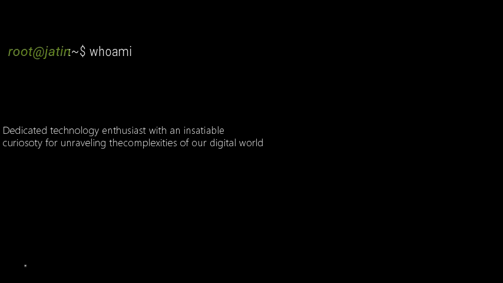

<!-- ════════════════════════════════════════════════════════════════
     JATIN GHOYAL — Premium GitHub Profile README
     AI Engineer • Data Scientist • Robotics • Full Stack Developer
     ════════════════════════════════════════════════════════════════ -->

<!-- ╔══════════════════════╗
     ║   HERO VIDEO/GIF    ║
     ╚══════════════════════╝ -->

<!--
  📽️  VIDEO SETUP INSTRUCTIONS
  ─────────────────────────────────────────────────────────────────────
  GitHub does NOT support embedded <video> tags or MP4 in README files.
  
  ✅ STEP 1 — Convert BANNER.mp4 → assets/hero.gif using FFmpeg:
  
  ffmpeg -i BANNER.mp4 -vf "fps=15,scale=1200:-1:flags=lanczos,split[s0][s1];[s0]palettegen=max_colors=128[p];[s1][p]paletteuse=dither=bayer" -loop 0 assets/hero.gif
  
  ✅ STEP 2 — If the file is too large (>15MB), reduce quality:
  
  ffmpeg -i BANNER.mp4 -vf "fps=10,scale=900:-1:flags=lanczos,split[s0][s1];[s0]palettegen=max_colors=64[p];[s1][p]paletteuse=dither=bayer" -loop 0 assets/hero.gif
  
  ✅ STEP 3 — Push assets/hero.gif to your GitHub profile repo.
  
  The img tag below will automatically display it. 🚀
  ─────────────────────────────────────────────────────────────────────
-->

<p align="center">
  
</p>

---

<!-- ╔══════════════════════╗
     ║    NAME & TITLE     ║
     ╚══════════════════════╝ -->

<div align="center">

# `> Jatin Ghoyal`

[](https://git.io/typing-svg)

</div>

---

<!-- ╔══════════════════════╗
     ║   TERMINAL BIO      ║
     ╚══════════════════════╝ -->

<div align="center">
  
</div>

---

<!-- ╔══════════════════════╗
     ║   SOCIAL LINKS      ║
     ╚══════════════════════╝ -->

<div align="center">

[](https://github.com/JatinGhoyal)
[](https://linkedin.com/in/JatinGhoyal)
[](https://JatinGhoyal.dev)
[](mailto:jatin@example.com)

</div>

---

<!-- ╔══════════════════════════╗
     ║   GITHUB STATS ROW 1   ║
     ╚══════════════════════════╝ -->

<div align="center">

<table>
<tr>
<td width="50%" align="center">


</td>
<td width="50%" align="center">


</td>
</tr>
</table>

</div>

---

<!-- ╔══════════════════════════╗
     ║   TOP LANGUAGES         ║
     ╚══════════════════════════╝ -->

<div align="center">


</div>

---

<!-- ╔══════════════════════════╗
     ║   TECH STACK            ║
     ╚══════════════════════════╝ -->

## `💻 Tech Stack`

<div align="center">

### 🔤 Languages


### 🎨 Frontend


### 📱 Mobile


### ⚙️ Backend


### 🗄️ Database


### 🤖 AI / ML


### 🛠️ Tools & Platforms


</div>

---

<!-- ╔══════════════════════════╗
     ║   FEATURED PROJECTS     ║
     ╚══════════════════════════╝ -->

## `🚀 Featured Projects`

<div align="center">

<table>
<tr>

<!-- Project 1: AlpheeEats -->
<td width="33%" align="center" valign="top">
<a href="https://github.com/JatinGhoyal/AlpheeEats">

**🍔 AlpheeEats**

</a>

> Campus Food Delivery Platform


Real-time campus food ordering with live order tracking and smart restaurant dashboard.

[](https://github.com/JatinGhoyal/AlpheeEats)

</td>

<!-- Project 2: AutoFinder -->
<td width="33%" align="center" valign="top">
<a href="https://github.com/JatinGhoyal/AutoFinder">

**🚖 AutoFinder**

</a>

> Campus Auto Booking Platform


Campus auto-rickshaw booking with GPS tracking, fare estimation and driver matching.

[](https://github.com/JatinGhoyal/AutoFinder)

</td>

<!-- Project 3: Alphee -->
<td width="33%" align="center" valign="top">
<a href="https://github.com/JatinGhoyal/Alphee">

**📹 Alphee**

</a>

> Interest-based WebRTC Chat Platform


Real-time interest-matched video chat with end-to-end encrypted WebRTC streams.

[](https://github.com/JatinGhoyal/Alphee)

</td>

</tr>
<tr>

<!-- Project 4: AI Projects -->
<td width="33%" align="center" valign="top">
<a href="https://github.com/JatinGhoyal?tab=repositories&q=AI">

**🤖 AI Projects**

</a>

> Machine Learning & Deep Learning


Collection of ML/DL models including Computer Vision, NLP and Reinforcement Learning projects.

[](https://github.com/JatinGhoyal?tab=repositories&q=AI)

</td>

<!-- Project 5: Codersao -->
<td width="33%" align="center" valign="top">
<a href="https://github.com/Codersao">

**🏢 Codersao**

</a>

> Software · AI · Robotics Agency


Software development agency focused on AI, Robotics, and scalable full-stack solutions.

[](https://github.com/Codersao)

</td>

<td width="33%" align="center" valign="top">

**🌱 More Coming Soon**

> Currently in Development

Working on exciting new projects in CV, NLP and Autonomous Systems.

[](https://github.com/JatinGhoyal)

</td>

</tr>
</table>

</div>

---

<!-- ╔══════════════════════════╗
     ║   ACTIVITY GRAPH        ║
     ╚══════════════════════════╝ -->

## `📈 Activity Graph`

<div align="center">

[](https://github.com/ashutosh00710/github-readme-activity-graph)

</div>

---

<!-- ╔══════════════════════════╗
     ║   ACHIEVEMENTS          ║
     ╚══════════════════════════╝ -->

## `🏆 Achievements`

<div align="center">

<table>
<tr>

<td align="center" width="18%">
<br/>

<br/><sub><b>Live Projects</b></sub>
</td>

<td align="center" width="18%">
<br/>

<br/><sub><b>Open Source</b></sub>
</td>

<td align="center" width="18%">
<br/>

<br/><sub><b>Certifications</b></sub>
</td>

<td align="center" width="18%">
<br/>

<br/><sub><b>Hackathons</b></sub>
</td>

<td align="center" width="18%">
<br/>

<br/><sub><b>Contributions</b></sub>
</td>

</tr>
</table>

</div>

---

<!-- ╔══════════════════════════╗
     ║   CERTIFICATIONS        ║
     ╚══════════════════════════╝ -->

## `📜 Certifications`

<div align="center">

<table>
<tr>

<!-- CERTIFICATE CARD 1 — IBM Python for Data Science, AI & Development -->
<td align="center" width="33%" valign="top">
<br/>
<a href="#" title="IBM Python for Data Science, AI & Development">

</a>
<br/><br/>

**📋 Python for Data Science, AI & Development**

<sub>🏛️ IBM — Coursera</sub>
<br/><br/>
[](https://example.com)

</td>

<!-- CERTIFICATE CARD 2 — Python Developer by FreeCodeCamp -->
<td align="center" width="33%" valign="top">
<br/>
<a href="#" title="Python Developer — freeCodeCamp">

</a>
<br/><br/>

**📋 Scientific Computing with Python**

<sub>🏛️ freeCodeCamp</sub>
<br/><br/>
[](https://example.com)

</td>

<!-- CERTIFICATE CARD 3 — Foundational C# with Microsoft by FreeCodeCamp -->
<td align="center" width="33%" valign="top">
<br/>
<a href="#" title="Foundational C# with Microsoft — freeCodeCamp">

</a>
<br/><br/>

**📋 Foundational C# with Microsoft**

<sub>🏛️ Microsoft × freeCodeCamp</sub>
<br/><br/>
[](https://example.com)

</td>

</tr>
</table>

> 💡 **Add more certs:** Drop `.jpg` / `.png` files into `assets/certificates/` and add a new `<td>` card above.

</div>

---

<!-- ╔══════════════════════════╗
     ║   ABOUT ME (FULL)       ║
     ╚══════════════════════════╝ -->

## `👨‍💻 About Me`

<div align="center">

```python
class JatinGhoyal:
    def __init__(self):
        self.name       = "Jatin Ghoyal"
        self.role       = "AI Engineer • Data Scientist • Full Stack Developer"
        self.education  = "B.Tech CSE @ Central University of Punjab (2024–2028)"
        self.focus      = ["Artificial Intelligence", "Deep Learning", "Computer Vision",
                           "Robotics", "Full Stack Development"]
        self.languages  = ["Python", "C++", "Java", "JavaScript", "PHP", "Dart"]
        self.currently  = "Building intelligent systems that solve real-world problems"
        self.org        = "Codersao — Software · AI · Robotics"
        self.contact    = "Open to collaborations, internships & open-source contributions"

    def greet(self):
        return f"Hey 👋, I'm {self.name} — {self.currently} 🚀"

me = JatinGhoyal()
print(me.greet())
# Output: Hey 👋, I'm Jatin Ghoyal — Building intelligent systems that solve real-world problems 🚀
```

</div>

---

<!-- ╔══════════════════════════╗
     ║   CURRENT FOCUS         ║
     ╚══════════════════════════╝ -->

## `🎯 Current Focus`

<div align="center">

| Domain | Technologies | Status |
|:------:|:------------:|:------:|
| 🤖 Artificial Intelligence | TensorFlow, Scikit-learn, OpenCV | 🔥 Active |
| 📊 Data Science | Pandas, NumPy, Matplotlib | 🔥 Active |
| 👁️ Computer Vision | OpenCV, YOLO, TensorFlow | 🔥 Active |
| 🦾 Robotics | ROS, Sensors, Embedded Systems | 🌱 Learning |
| 🌐 Full Stack Dev | MERN, Flutter, Firebase | 🔥 Active |
| 📱 Mobile Development | Flutter, Android, Dart | ✅ Proficient |

</div>

---

<!-- ╔══════════════════════════╗
     ║   CONTRIBUTION SNAKE    ║
     ╚══════════════════════════╝ -->

## `🐍 Contribution Snake`

<div align="center">

<picture>
  <source media="(prefers-color-scheme: dark)" srcset="https://raw.githubusercontent.com/JatinGhoyal/JatinGhoyal/output/github-contribution-grid-snake-dark.svg"/>
  <source media="(prefers-color-scheme: light)" srcset="https://raw.githubusercontent.com/JatinGhoyal/JatinGhoyal/output/github-contribution-grid-snake.svg"/>
  
</picture>

> ⚙️ Enable the [snake workflow](.github/workflows/snake.yml) for live contribution snake animation.

</div>

---

<!-- ╔══════════════════════════╗
     ║   CONTACT               ║
     ╚══════════════════════════╝ -->

## `📬 Let's Connect`

<div align="center">

> 💬 *I'm always open to interesting conversations, collaborations, and new opportunities.*

<br/>

[](https://github.com/JatinGhoyal)
[](https://linkedin.com/in/JatinGhoyal)
[](https://JatinGhoyal.dev)
[](mailto:jatin@example.com)

</div>

---

<!-- ╔══════════════════════════╗
     ║   PROFILE VIEWS         ║
     ╚══════════════════════════╝ -->

<div align="center">


<br/>

<!-- Footer wave -->


<sub>⚡ Crafted with passion by <a href="https://github.com/JatinGhoyal"><b>Jatin Ghoyal</b></a> — AI Engineer & Data Scientist</sub>

</div>

<!-- ════════════════════════════════════════════════════════════════
     END OF README
     ════════════════════════════════════════════════════════════════ -->
